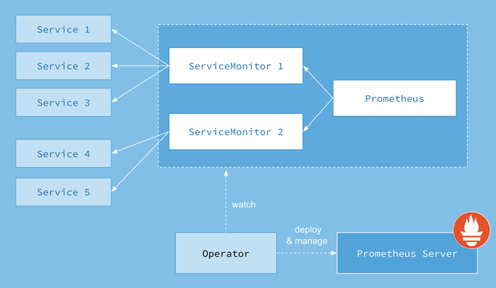

# 02 - Configuration Prometheus
## Prometheus
### General 

Doc :
- https://prometheus-operator.dev/docs/operator/design/

After we successfully deployed Prometheus Operator we should see a new CRDs :

```console
[root@workstation ~ ]$ oc get crd | grep monitoring
alertmanagerconfigs.monitoring.coreos.com                         2021-10-06T09:48:54Z
alertmanagers.monitoring.coreos.com                               2021-10-06T09:48:57Z
podmonitors.monitoring.coreos.com                                 2021-10-06T09:48:59Z
probes.monitoring.coreos.com                                      2021-10-06T09:49:02Z
prometheuses.monitoring.coreos.com                                2021-10-06T09:49:04Z
prometheusrules.monitoring.coreos.com                             2021-10-06T09:49:07Z
servicemonitors.monitoring.coreos.com                             2021-10-06T09:49:09Z
thanosrulers.monitoring.coreos.com
```

- The `Prometheus` custom resource definition (CRD) declaratively defines a desired Prometheus setup to run in a Kubernetes cluster. It provides options to configure replication, persistent storage, and Alertmanagers to which the deployed Prometheus instances send alerts to. For each `Prometheus resource`, the Operator deploys a properly configured `StatefulSet` in the same namespace. The Prometheus `Pods` are configured to mount a Secret called `<prometheus-name>` containing the configuration for Prometheus.
- The `Alertmanager` custom resource definition (CRD) declaratively defines a desired Alertmanager setup to run in a Kubernetes cluster. It provides options to configure replication and persistent storage.
- The `AlertmanagerConfig` custom resource definition (CRD) declaratively specifies subsections of the Alertmanager configuration, allowing routing of alerts to custom receivers, and setting inhibit rules. The AlertmanagerConfig can be defined on a namespace level providing an aggregated config to Alertmanager. An example on how to use it is provided here. Please be aware that this CRD is not stable yet.
- The `ThanosRuler` custom resource definition (CRD) declaratively defines a desired Thanos Ruler setup to run in a Kubernetes cluster. With Thanos Ruler recording and alerting rules can be processed across multiple Prometheus instances.
- The `ServiceMonitor` custom resource definition (CRD) allows to declaratively define how a dynamic set of services should be monitored. Which services are selected to be monitored with the desired configuration is defined using label selections. This allows an organization to introduce conventions around how metrics are exposed, and then following these conventions new services are automatically discovered, without the need to reconfigure the system.
- The `PodMonitor` custom resource definition (CRD) allows to declaratively define how a dynamic set of pods should be monitored. Which pods are selected to be monitored with the desired configuration is defined using label selections. This allows an organization to introduce conventions around how metrics are exposed, and then following these conventions new pods are automatically discovered, without the need to reconfigure the system.
- The `Probe` custom resource definition (CRD) allows to declarative define how groups of ingresses and static targets should be monitored. Besides the target, the Probe object requires a prober which is the service that monitors the target and provides metrics for Prometheus to scrape. This could be for example achieved using the `blackbox exporter`.
- The `PrometheusRule` custom resource definition (CRD) declaratively defines a desired Prometheus rule to be consumed by one or more Prometheus instances.

Prometheus Operator architecture: 

<p align="center">
  
</p>

Prometheus Operator uses a CRD, named ServiceMonitor, to abstract the configuration to target. This merely defines how a set of services should be monitored.

### ServiceMonitor

Both `ServiceMonitors` as well as discovered targets may come from any namespace. This is important to allow cross-namespace monitoring use cases, e.g. for meta-monitoring. Using the `ServiceMonitorNamespaceSelector` of the `PrometheusSpec`, one can restrict the namespaces `ServiceMonitors` are selected from by the respective Prometheus server. Using the `namespaceSelector` of the `ServiceMonitorSpec`, one can restrict the namespaces the Endpoints objects are allowed to be discovered from. To discover targets in all namespaces the namespaceSelector has to be empty:

```yaml
spec:
  namespaceSelector:
    any: true
```

Prometheus Operator uses labels to identify resources to scrape, such as `podMonitor` and `serviceMonitor`.
Your Prometheus CRD is already set to allow `podMonitor` and `serviceMonitor` scraping. To be able to scrape these objects, you need to add a label. The required label can be found in the `prometheus` object :

```
oc get prometheus prometheus-stack-kube-prom-prometheus -o yaml | oc neat
```

```yaml
apiVersion: monitoring.coreos.com/v1
kind: Prometheus
metadata:
  name: prometheus-stack-kube-prom-prometheus
  namespace: monitoring-custom
spec:
  podMonitorSelector:
    matchLabels:
      release: prometheus-stack
  serviceMonitorSelector:
    matchLabels:
      release: prometheus-stack
```

You can obviously label your service monitor by executing the following command :

```
oc label servicemonitor blackbox-servicemonitor release=prometheus-stack
```

Result :
```yaml
apiVersion: monitoring.coreos.com/v1
kind: ServiceMonitor
metadata:
  labels:
    release: prometheus-stack
  name: argocd-metrics
  namespace: monitoring-custom
spec:
  endpoints:
  - port: metrics
  namespaceSelector:
    matchNames:
    - argocd
  selector:
    matchLabels:
      app.kubernetes.io/name: argocd-metrics
```

### Retention
You can change the prometheus retention directly in the `prometheus` CRD under the section `spec.retention` :
```yaml
spec:
  retention: 10d
```

But its better to do it directly in the `values.yaml` under the `prometheus.prometheusSpec` section:
```yaml
    ## How long to retain metrics
    ##
    retention: 10d

    ## Maximum size of metrics
    ##
    retentionSize: ""
```